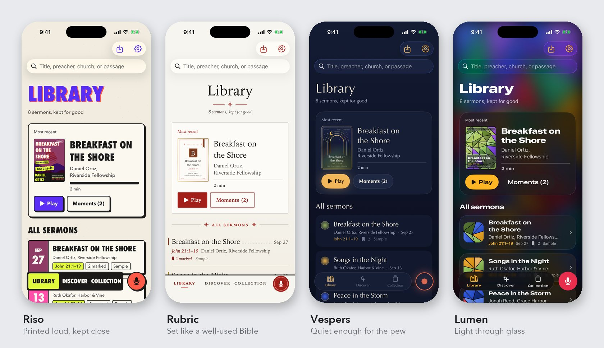
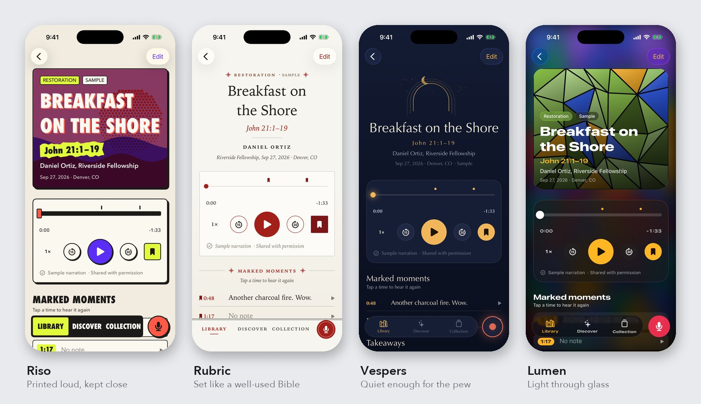
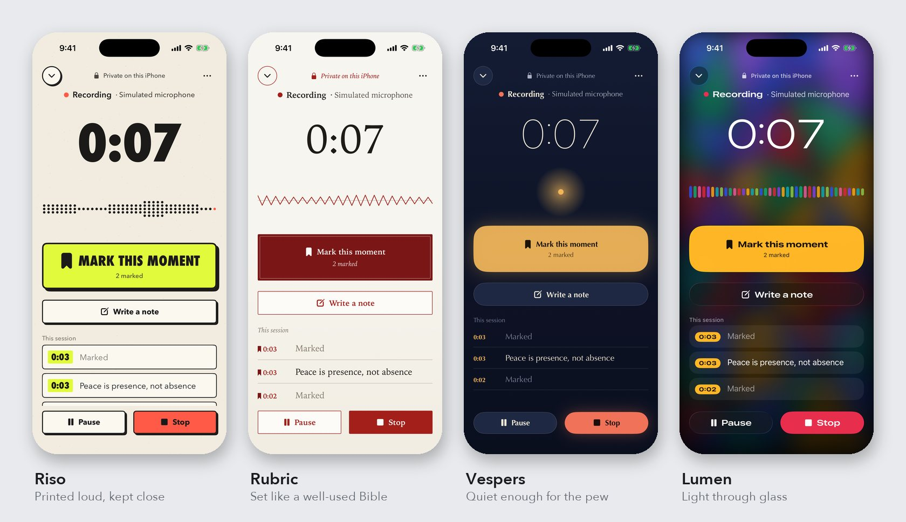
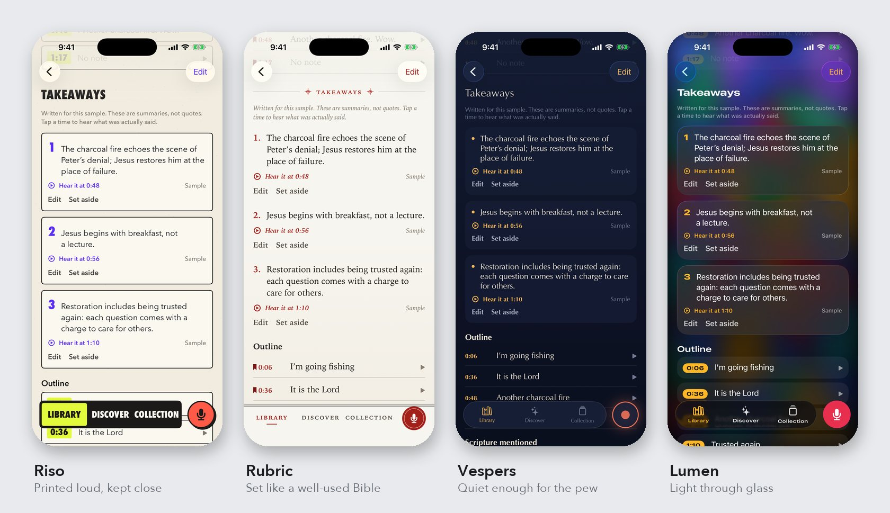
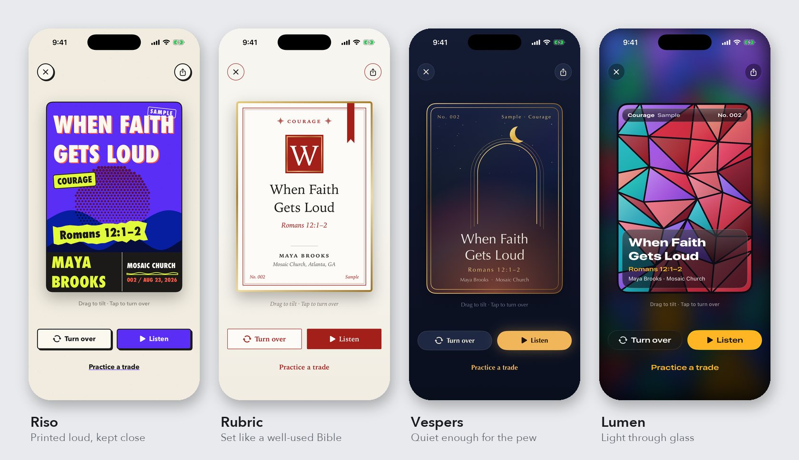
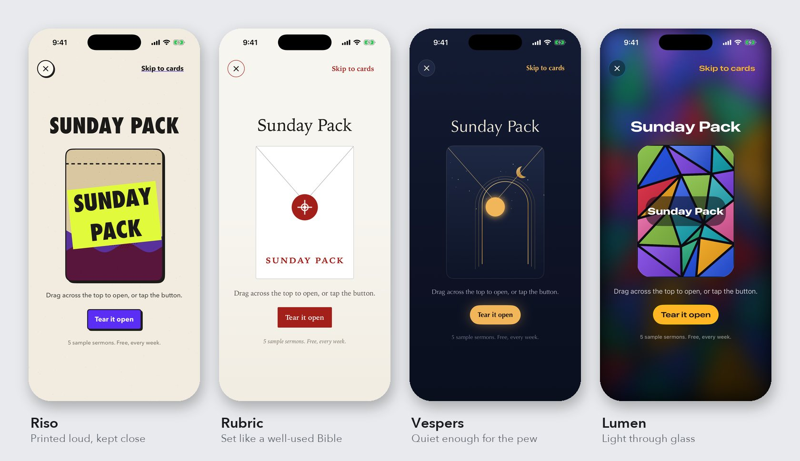
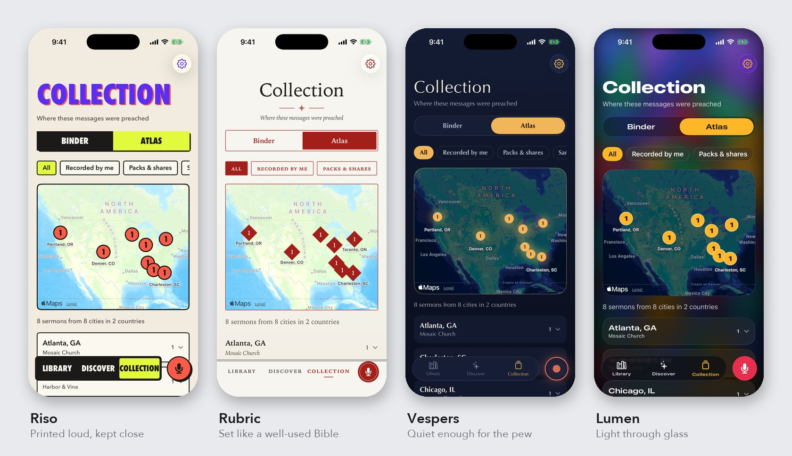
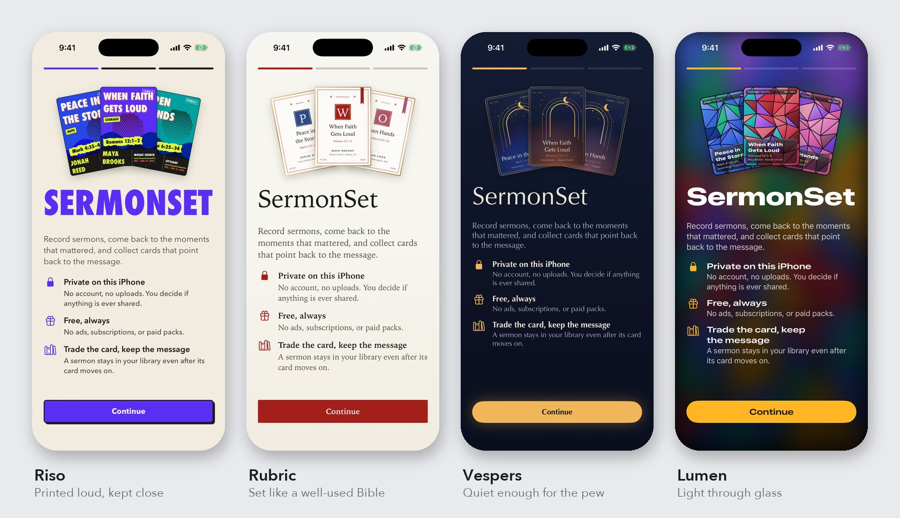

# SermonSet

**Trade the card. Keep the message.**

A free, private iPhone app for recording sermons, coming back to the moments that
mattered, and collecting cards that point back to the message. Native Swift and
SwiftUI for iOS 26. Everything stays on the phone, and every feature is free.

<p align="center"><a href="https://github.com/gazhenko/sermonset-ios/releases/download/v0.1.0-prototype/SermonSet-trailer.mp4"><b>▶ Watch the trailer</b></a> · 1 minute · 1080p · sound on</p>

<p align="center"><a href="https://github.com/gazhenko/sermonset-ios/releases/download/v0.1.0-prototype/SermonSet-trailer.mp4"></a></p>

The trailer is filmed from the running app in the iOS Simulator by a scripted UI test.
The voices are the app's fictional sample sermons.

## Four looks

The prototype ships four complete visual directions. Screens, features, and behavior
are identical; switch between them during onboarding or in Settings, where you can
also match the app icon.



| Look | Built from |
| --- | --- |
| **Riso** | A two-ink church zine: condensed poster type, riso inks on cream stock, a hard offset like a second print pass. The direction set by the original card prototype. |
| **Rubric** | A well-used Bible: rubric red, timestamps in the margin like verse numbers, ribbons for marked moments, card colors from the liturgical calendar. |
| **Vespers** | Evening prayer: night blue and candlelight, dim enough to use in a dark sanctuary, set in Optima. |
| **Lumen** | A lit stained-glass window behind iOS 26 Liquid Glass, with jewel-pane card art. |

## Screens

**Revisit a sermon.** The player shows your marked moments on the timeline.



**Record from the pew.** One large Mark this moment button, timestamped notes, and a
level meter. Audio is saved in durable pieces, so an interruption or crash can't take
the sermon.



<details>
<summary><b>More screens</b>: takeaways, cards, the Sunday Pack, the Atlas, and onboarding</summary>

**Takeaways linked to the audio.** Drafted on the iPhone, labeled as summaries rather
than quotes, and kept only if you keep them. "Hear it at 0:48" plays the exact passage.



**Cards.** Tilt, turn over, listen, share an image, or practice a trade. Trading moves
the card; the sermon, your notes, and your moments stay in your library.



**The Sunday Pack.** A free weekly discovery ritual: no purchases, no odds.



**The Atlas.** Where the sermons in your library were preached, pinned at city level,
never where you were.



**First run.** No account; start by recording, importing audio, or exploring samples.



</details>

## Status

A working prototype on the iOS 26.5 Simulator. Not yet tested on a physical iPhone.

- **Works:**
  - Private recording with a consent check, Mark this moment, timestamped notes, and
    recovery after a crash.
  - Library and sermon pages: the player, evidence-linked takeaways, the transcript, and
    private notes.
  - Sunday Pack, 3D cards, the trade preview, and the Atlas.
  - Settings, and four looks with matching app icons.
- **Verified:**
  - 37 core tests and 5 UI journeys pass, and the app builds without warnings.
  - Apple's on-device Foundation Models drafted evidence-linked takeaways in the Simulator.
- **Not yet:**
  - Real-iPhone capture: long sermons, phone calls, battery, and heat.
  - Live speech transcription, which is unavailable in the Simulator.
  - Accounts, real trading, and church publishing.

Details: [prototype notes](docs/prototype/README.md) · [verification record](docs/REVIEW.md) ·
[core API](docs/prototype/CORE-NOTES.md).

## Run it

Requires Xcode 26.6 and [XcodeGen](https://github.com/yonaskolb/XcodeGen).

```sh
xcodegen generate
open SermonSet.xcodeproj   # run the SermonSet scheme on an iPhone 17 Pro simulator
```

Launch arguments: add `-SermonSetPreviewData` to start with the eight sample sermons
loaded, `-SermonSetLook riso|rubric|vespers|lumen` to start in a look, and
`-SermonSetSimulatedCapture` to record without a microphone.

Without building, use the Simulator app from the
[v0.1.0-prototype release](https://github.com/gazhenko/sermonset-ios/releases/tag/v0.1.0-prototype):

```sh
unzip SermonSet-0.1.0-Simulator.zip
xcrun simctl install booted SermonSet.app
xcrun simctl launch booted com.gazhenko.sermonset
```

Tests: `scripts/dev.sh test` runs the core suite; `xcodebuild … -only-testing:SermonSetUITests test` runs the UI journeys.

## Pilot

The owner selected iPhone 17 Pro, iOS 26.6.2, and English (United States). Verify the
actual device and installed SDK before claiming compatibility. Simulator results are
not physical-device evidence.

## Product rules

- A sermon is the useful object; cards point into it.
- Trading never removes a sermon from library history or transfers private notes.
- Preserve original audio. No silent cloud fallback from local-only processing.
- Save capture state before recording; use durable segments and recovery manifests.
- Private capture works without AI, account, location, or internet.
- Summaries require versioned transcript evidence and playable audio ranges.
- Public publishing, rights policy, trading, and moderation are later slices.
- No claims of guaranteed permanent hosting, verified sample content, or tested
  hardware without evidence.

## Repository

- `SermonSet/`: the SwiftUI app; `Looks/` holds the four visual systems.
- `Packages/SermonSetCore/`: capture, storage, playback, on-device AI adapters, and
  collection logic, with tests and the bundled sample sermons.
- `SermonSetUITests/`: end-to-end journeys, plus the scripted trailer tour.
- `tools/trailer/`: films and cuts the trailer (`record.sh`, `cards.swift`, `edit.py`, `edl.json`).
- `tools/readme/compose.py`: builds the four-look comparison images in `docs/media/`.

Project Desk holds the task board and recorded owner decisions:
https://project-desk-sermonset.gazhenko-jemmy.chatgpt.site/?project=sermonset

Sample people, churches, sermons, and voices are fictional.
